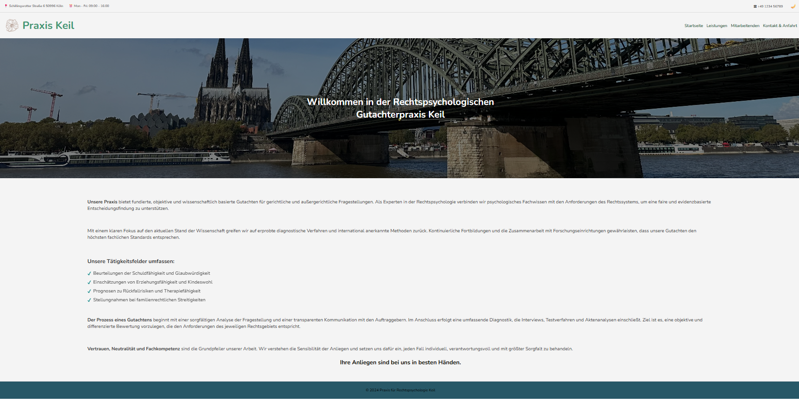
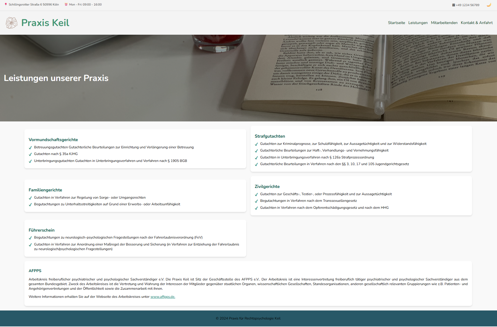

# Forensic Psychology Practice Webseite

Responsive website for a forensic psychology practice, developed with HTML, CSS and JavaScript.

This project was developed as part of the university course "Berufsvorbereitung - Webdesign und Multimedia"

---

## Overview

The project is a static multi-page website for a fictional forensic psychology practice.

The goal was to design and implement a professional-looking website with clear navigation, structured content, responsive layout and basic interactive functionality.

The website includes information about the practice, offered services, team members and contact details.

---

## Pages

- Hompage
- Services
- Team Members
- Contact & Directions

---

## Features

- Responsive multi-page layout
- Navigation menu
- Hero image sections
- Service overview cards
- Contact and location page
- Dark mode toggle
- Persistent dark mode state using Local Storage
- Custom styling with CSS
- Static website structure without external frameworks

---

## Technologies

- HTML5
- CSS3
- JavaScript
- Local Storage API

---

## Screenshots

### Hompage



### Service Page



---

## Project Structure

```text
resources/
    Images, favicon and logo

assets/
    README screenshots

startseite.html
leistungen.html
mitarbeitenden.html
kontakt-und-anfahrt.html

design.css
startseite.js